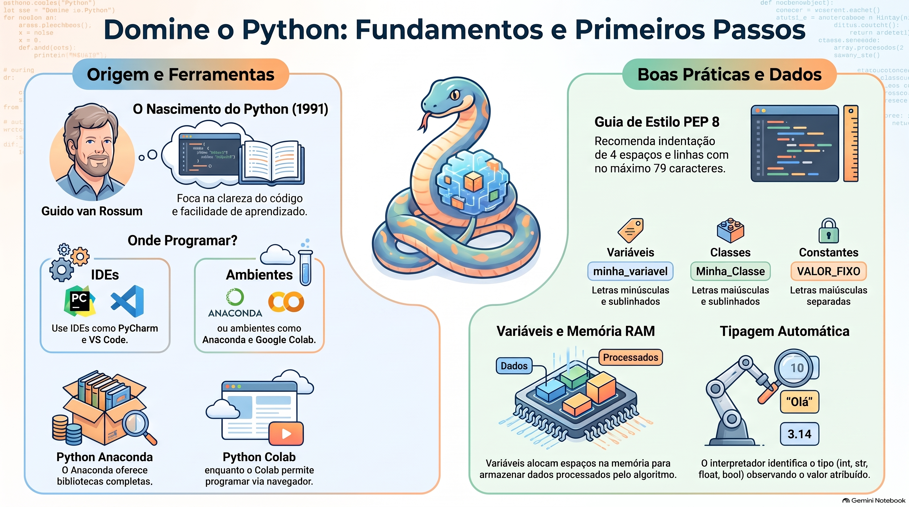

# 🐍 Python: Fundamentos e Primeiros Passos

Este repositório armazena meus resumos visuais e infográficos focados na evolução dos meus estudos em Python.

## 📊 Módulo 01: Fundamentos

Abaixo está o infográfico resumo cobrindo a origem da linguagem, ferramentas essenciais de desenvolvimento e conceitos iniciais de variáveis e boas práticas (PEP 8):

### 📌 Tópicos abordados:
- **Origem:** Criação por Guido van Rossum em 1991 com foco em legibilidade.
- **Ambientes e IDEs:** PyCharm, VS Code, Anaconda e Google Colab.
- **Boas Práticas (PEP 8):** Padrões de nomenclatura (snake_case para variáveis/funções, CamelCase para classes) e guia de identação.
- **Tipagem e Memória:** Como as variáveis alocam espaço na RAM e a tipagem automática do interpretador (`int`, `str`, `float`, `bool`).

---
📫 Sinta-se à vontade para acompanhar minha evolução na programação!
